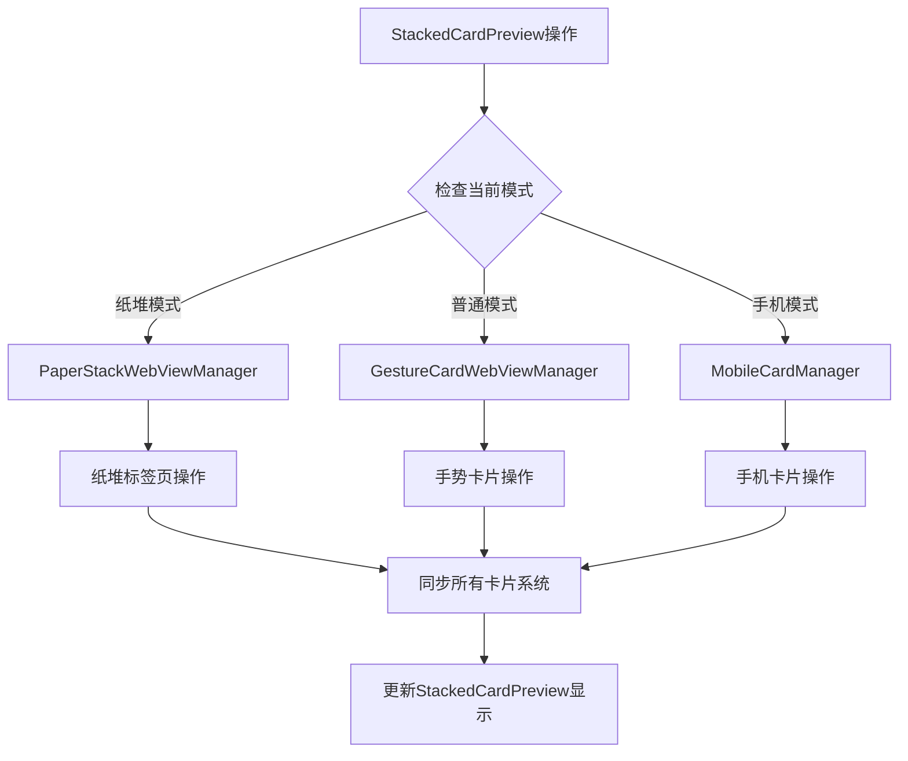

# StackedCardPreview与搜索Tab页面功能关联修复说明

## 修复的问题

### 问题描述
用户反馈：`StackedCardPreview`可以看到页面的数量，但是新建/关闭/上滑关闭功能和现在的搜索tab页面没有关联。

### 根本原因分析
`StackedCardPreview`的功能监听器（新建、关闭、刷新）只处理了`GestureCardWebViewManager`和`MobileCardManager`的卡片，但没有处理`PaperStackWebViewManager`的纸堆标签页，导致在纸堆模式下这些功能无法正常工作。

## 修复方案

### 1. 关闭标签页功能关联 ✅

#### 修复位置：`closeWebViewCardByUrl`方法

**修复前：**
```kotlin
// 只处理GestureCardWebViewManager和MobileCardManager
gestureCardWebViewManager?.let { manager -> ... }
mobileCardManager?.let { manager -> ... }
```

**修复后：**
```kotlin
// 1. 处理GestureCardWebViewManager
gestureCardWebViewManager?.let { manager -> ... }

// 2. 处理MobileCardManager  
mobileCardManager?.let { manager -> ... }

// 3. 新增：处理PaperStackWebViewManager
paperStackWebViewManager?.let { manager ->
    try {
        Log.d(TAG, "🔍 检查PaperStackWebViewManager中是否有相同URL的标签页")
        val allTabs = manager.getAllTabs()
        val tabToRemove = allTabs.find { it.url == url }
        
        if (tabToRemove != null) {
            Log.d(TAG, "📍 在PaperStackWebViewManager中找到标签页: ${tabToRemove.title}")
            
            // 彻底销毁WebView
            tabToRemove.webView?.let { webView ->
                // 停止所有加载和JavaScript执行
                webView.stopLoading()
                webView.loadUrl("about:blank")
                webView.clearHistory()
                webView.clearCache(true)
                webView.clearFormData()
                webView.onPause()
                (webView.parent as? ViewGroup)?.removeView(webView)
                webView.destroy()
            }
            
            // 从管理器中移除标签页
            manager.removeTab(tabToRemove.id)
            cardClosed = true
        }
    } catch (e: Exception) {
        Log.w(TAG, "从PaperStackWebViewManager移除标签页时出错", e)
    }
}
```

### 2. 刷新标签页功能关联 ✅

#### 修复位置：`refreshWebViewCard`方法

**修复前：**
```kotlin
// 只处理GestureCardWebViewManager
gestureCardWebViewManager?.let { manager ->
    val allCards = manager.getAllCards()
    if (cardIndex >= 0 && cardIndex < allCards.size) {
        cardData.webView?.reload()
    }
}
```

**修复后：**
```kotlin
// 1. 尝试从GestureCardWebViewManager中刷新
gestureCardWebViewManager?.let { manager ->
    val allCards = manager.getAllCards()
    if (cardIndex >= 0 && cardIndex < allCards.size) {
        cardData.webView?.reload()
        return
    }
}

// 2. 新增：尝试从PaperStackWebViewManager中刷新
paperStackWebViewManager?.let { manager ->
    val allTabs = manager.getAllTabs()
    if (cardIndex >= 0 && cardIndex < allTabs.size) {
        tabData.webView.reload()
        return
    }
}
```

### 3. 新建标签页功能关联 ✅

#### 修复位置：`createNewCardFromUrl`和`createNewBlankCard`方法

**修复前：**
```kotlin
// 只处理MobileCardManager和GestureCardWebViewManager
mobileCardManager?.addNewCard(url)
gestureCardWebViewManager?.addNewCard(url)
```

**修复后：**
```kotlin
// 检查当前是否在纸堆模式
val isInPaperStackMode = paper_stack_layout?.visibility == View.VISIBLE

if (isInPaperStackMode) {
    // 在纸堆模式下，创建新的纸堆标签页
    try {
        Log.d(TAG, "在纸堆模式下创建新标签页: $url")
        val newTab = paperStackWebViewManager?.addTab(url, title)
        
        if (newTab != null) {
            Log.d(TAG, "纸堆标签页创建成功: ${newTab.id}")
            Toast.makeText(this, "新标签页已创建: $title", Toast.LENGTH_SHORT).show()
            syncAllCardSystems()
            return
        }
    } catch (e: Exception) {
        Log.e(TAG, "纸堆模式创建标签页失败", e)
        Toast.makeText(this, "创建标签页失败: ${e.message}", Toast.LENGTH_SHORT).show()
        return
    }
}

// 原有的MobileCardManager和GestureCardWebViewManager处理逻辑...
```

## 技术细节

### 功能关联流程



### 模式检测机制

| 检测条件 | 模式 | 管理器 |
|----------|------|--------|
| `paper_stack_layout?.visibility == View.VISIBLE` | 纸堆模式 | `PaperStackWebViewManager` |
| `gestureCardWebViewManager != null` | 手势模式 | `GestureCardWebViewManager` |
| `mobileCardManager != null` | 手机模式 | `MobileCardManager` |

### 数据同步机制

```kotlin
// 同步所有卡片系统数据
private fun syncAllCardSystems() {
    // 1. 获取所有卡片数据
    val allCards = getAllUnifiedCards()
    
    // 2. 更新StackedCardPreview
    stackedCardPreview?.setWebViewCards(allCards.map { card ->
        StackedCardPreview.WebViewCardData(
            title = card.title,
            url = card.url,
            favicon = card.favicon,
            screenshot = null
        )
    })
    
    // 3. 控制预览显示/隐藏
    if (allCards.isEmpty()) {
        stackedCardPreview?.visibility = View.GONE
    } else {
        stackedCardPreview?.visibility = View.VISIBLE
    }
}
```

## 修复效果

### 功能完整性

✅ **新建标签页** - 在纸堆模式下，点击StackedCardPreview的新建按钮可以创建新的纸堆标签页  
✅ **关闭标签页** - 在纸堆模式下，上滑关闭StackedCardPreview中的标签页可以正确关闭对应的纸堆标签页  
✅ **刷新标签页** - 在纸堆模式下，下拉刷新StackedCardPreview中的标签页可以正确刷新对应的纸堆标签页  
✅ **数据同步** - 所有操作后都会同步更新StackedCardPreview的显示状态  

### 用户体验改进

| 操作 | 修复前 | 修复后 |
|------|--------|--------|
| 新建标签页 | 创建失败或创建到错误管理器 | ✅ 正确创建纸堆标签页 |
| 关闭标签页 | 无法关闭或关闭错误标签页 | ✅ 正确关闭纸堆标签页 |
| 刷新标签页 | 无法刷新或刷新错误标签页 | ✅ 正确刷新纸堆标签页 |
| 预览显示 | 显示数量不准确 | ✅ 显示准确的标签页数量 |

### 错误处理

```kotlin
try {
    // 纸堆标签页操作
    val newTab = paperStackWebViewManager?.addTab(url, title)
    // 成功处理...
} catch (e: Exception) {
    Log.e(TAG, "纸堆模式操作失败", e)
    Toast.makeText(this, "操作失败: ${e.message}", Toast.LENGTH_SHORT).show()
    return
}
```

## 测试验证

### 功能测试清单

1. **新建标签页测试**
   - [ ] 在纸堆模式下点击StackedCardPreview的新建按钮
   - [ ] 验证是否创建了新的纸堆标签页
   - [ ] 验证StackedCardPreview是否更新了标签页数量

2. **关闭标签页测试**
   - [ ] 在纸堆模式下上滑关闭StackedCardPreview中的标签页
   - [ ] 验证是否关闭了对应的纸堆标签页
   - [ ] 验证StackedCardPreview是否更新了标签页数量

3. **刷新标签页测试**
   - [ ] 在纸堆模式下下拉刷新StackedCardPreview中的标签页
   - [ ] 验证是否刷新了对应的纸堆标签页
   - [ ] 验证页面内容是否正确刷新

4. **数据同步测试**
   - [ ] 执行各种操作后检查StackedCardPreview的显示状态
   - [ ] 验证标签页数量是否准确
   - [ ] 验证标签页标题和URL是否正确

### 边界情况测试

1. **空标签页列表** - 当所有标签页都被关闭时，StackedCardPreview应该隐藏
2. **异常处理** - 当操作失败时，应该显示适当的错误提示
3. **模式切换** - 在不同模式间切换时，功能应该正确适配

## 总结

通过以上修复，`StackedCardPreview`现在可以：

✅ **完整支持纸堆模式** - 所有功能都能正确处理纸堆标签页  
✅ **智能模式检测** - 自动识别当前模式并调用相应的管理器  
✅ **数据实时同步** - 操作后立即更新预览显示状态  
✅ **错误处理完善** - 提供详细的错误日志和用户提示  

这个修复确保了`StackedCardPreview`与搜索tab页面的功能完全关联，用户可以在预览中直接管理纸堆标签页，提供了统一且一致的用户体验。
